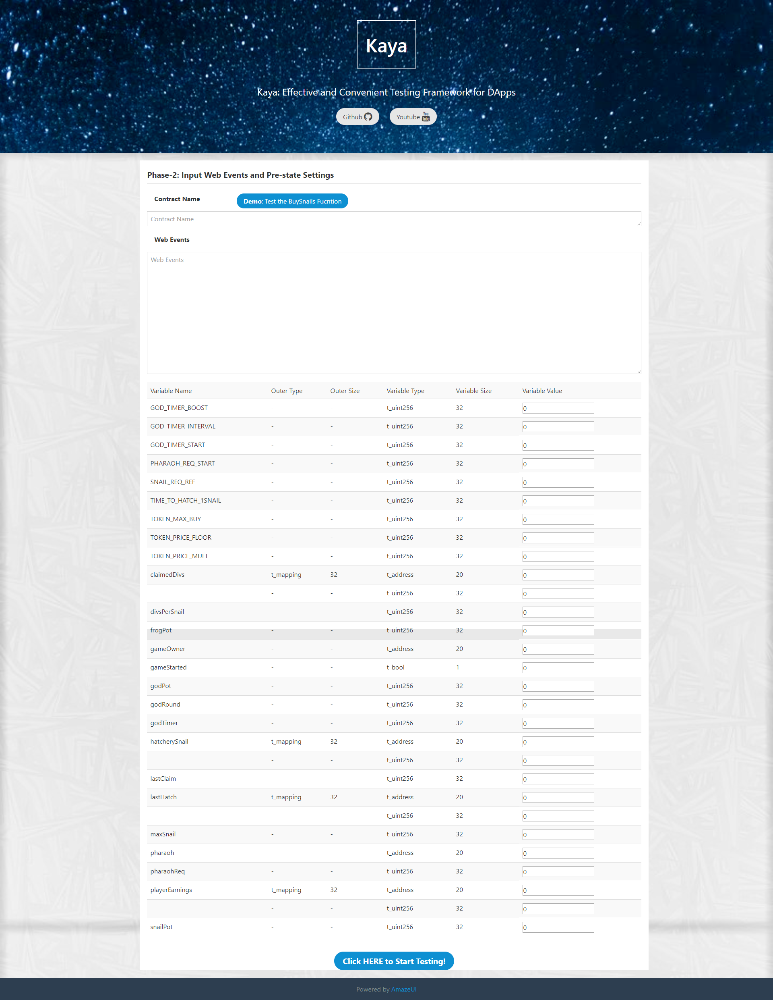

# Kaya

Kaya is an effective and convenient testing framework for DApps.

A brief introduction video has been uploaded to [Youtube](https://www.youtube.com/channel/UCrY4b9-WeCPyWDn-58Na4Eg).

## Installation

Kaya has two parts, support server and middle server. 

You can distribute them in the same device or different device.

If you have a demand for large-scale testing, you can distribute several middle servers in different devices, support server will accept all requests from them.

### Install Support Server

Support Server takes the responsibility of low-level execution. It can accept requests from middle server.

Because Support Server will call EVM and Solidity compiler, we suggest you to deploy it in Ubuntu System which is convenient to install EVM and Solidity compiler.

1. Install EVM, following steps are useful if your OS is Ubuntu:
   ```shell
   sudo apt-get install software-properties-common
   sudo add-apt-repository -y ppa:ethereum/ethereum
   sudo apt-get update
   sudo apt-get install ethereum
   ```
   If your system is not ubuntu, we suggest you to visit the github repository, [**go-ethereum**](https://github.com/ethereum/go-ethereum)
2. Installing Solidity Compiler, we suggest you to download the binary program from the releases in github repository, [**solidity**](https://github.com/ethereum/solidity/releases)
3. After installing EVM and Solidity compiler, you should add them in `PATH`.
4. Install related packages recorded in `requirements_support_server.txt`.
5. Download the source code of Support Server, set your configures in `config.py`, run Support Server with following command:
   ```shell
   python3 support_server.py
   ```

### Install Middle Server

Middle Server contains most logic tasks in Kaya. The web crawler is also included in Middle Server.

If you want to use Kaya via browser, Middle Server can be installed in both remote server or local machine. However, if you want to use the Kaya command line tool, `kaya_cmd`, you have to install Middle Server in local machine.

1. Download the source code of Middle Server.
2. Install related packages recorded in `requirements_middle_server.txt`.
3. Download Selenium browser driver, we recommend Chrome. The Chrome driver can download in website [ChromeDriver](https://sites.google.com/a/chromium.org/chromedriver/downloads), you can choose the version corresponds to your installed Chrome. Other driver can be download in website [Selenium-Downloads](https://selenium.dev/downloads/).
4. If you want to separate the browser Kaya used from default browser, you should set a new path to store the data produced by Kaya. Then, you need to launch the browser, install the MetaMask and log in MetaMask. **If you want to user browsers instead of Chrome, we cannot prove it will run normally.**
5. Set your configures in `config.py`, run Middle Server with command:
   ```shell
   python3 middle_server.py
   ```

## Use Kaya

Testers can use Kaya through browser to visit Tester Interface or use command line tool `kaya_cmd`.

### Tester Interface

Tester Interface is a web interface designed for primary testers. If users test their DApps through it, users should input the contract name and contract source code first.


Then, Kaya will jump to the second page, users can get all the variables which can be set initial values. If necessary, users can input the web events with DBDL language (This language will be introduced in next section), the contract name is also needed.


Last, Kaya will output the variables whose value has been changed. There are following situations:
- If the initial value of a variable is set, and the final value is the same, it will not be shown.
- If the initial value of a variable is not set, and the final value is not 0, it will be shown.
- If the initial value of a variable is set, and the final value is not the same as the set initial value, it will be shown.
- If the initial value of a variable is not set, and the final value is also 0, it will not be shown.


### Command Line Tool

Experienced testers can use Kaya with command line tool, `kaya_cmd`. If you want to use `Kaya_cmd`, you should install Middle Server in your local machine now (We are planning to separate them in future).

`kaya_cmd` supports two main functions, one is that get the variables can be set initial values, the other is that perform test cases.

To get variables, you can use following command in Middle Server directory:
```shell
./kaya_cmd -n SnailThrone -s content.sol
```
The `content.sol` is the file contains the source code of smart contract, the `SnailThrone` is the name of this smart contract.

To perform test cases, you can use following command:
```shell
./kaya_cmd -n SnailThrone -s content.sol -d test_SnailThrone.dbdl
```
The `test_SnailThrone.dbdl` is the file contains the test cases written with DBDL language.

## DApp Behavior Description Language (DBDL)

DBDL language is created for writing test cases conveniently in Kaya. It is flexible enough to set variables with initial values, add user behaviors, and user information. These three parts are elements in `root`. A full example can be seen in file [practical_case.dbdl](./practical_case.dbdl).

### User Behaviors

For user behavior, DBDL supports range focus, value filtering, and action execution.

An example of user behavior is the following:
```xml
<Transactions type="list">
    <item type="dict">
        <name type="str">Buy Snails</name>
        <url type="str">https://snailking.github.io/snailthrone/game?utm_source=StateOfTheDApps</url>
        <items type="list">
            <item type="dict">
                <area type="list">
                    <item type="dict">
                        <class-name type="str">card-deck</class-name>
                    </item>
                </area>
                <tag_name type="str">input</tag_name>
                <filter_key type="str">id</filter_key>
                <filter_value type="str">fieldBuy</filter_value>
                <action type="str">insert</action>
                <action_value type="str">5</action_value>
            </item>
            <item type="dict">
                <area type="list">
                    <item type="dict">
                        <class-name type="str">card-deck</class-name>
                    </item>
                </area>
                <tag_name type="str">button</tag_name>
                <filter_key type="str">onclick</filter_key>
                <filter_value type="str">webBuySnail()</filter_value>
                <action type="str">click</action>
                <action_value type="str">This will be used only when action is `insert`</action_value>
                <switch_window type="str">MetaMask Notification</switch_window>
            </item>
        </items>
    </item>
</Transactions>
```

The outermost label is `Transactions`, the type of it is `list`, all test cases are listed in it.

A single test case is wrapped by item with its type, `dict`. It contains three elements, the `name` of this test case, the `url` of the website this test case happens and a list of detailed actions. The default value of `url` is the url of SnailThrone.

a detailed action must be consist of a `tag_name`, a `filter_key`, a `filter_value`, a `action`, The `area`, `action_value`, `switch_windows` are optional.

For tag `area`, it can be considered as a list, every object in this list is a dict with one key and value to indicate the element in webpage and all other following actions are performed in this element. If there are multiple objects in `area`, Kaya will find the next element under the previous element. The available tags for the key is list in following table.

|Tag Name|Tag meaning|Set Value|Found Element in HTML|
|:--:|:--:|:--:|:--:|
|`class-name`|Find element by the value of attribute class|"yes"|`<input class="yes">`|
|`class-name-more`|Find all elements whose attribute class are equal to the value|"yes"|`[<input class="yes">, <tr class="yes"></tr>]`|
|`id`|Find element by the value of attribute id|"yes"|`<input id="yes">`|
|`id-more`|Find all elements whose attribute id are equal to the value|"yes"|`[<input id="yes">, <tr id="yes"></tr>]`|
|`tag-name`|Find element by the tag|"td"|`<td>yes</td>`|
|`tag-name-more`|Find all elements whose tag are equal to the value|"td"|`[<td>yes</td>, <td>no</td>]`|

For `tag_name` in a detailed action, it means to find the element in webpage whose tag is this value.

`filter_key` and `filter_value` are used to filter the elements found by `tag_name`. If a element whose value of the attribute `filter_key` is equal to `filter_value`, this element is the final element found by Kaya.

For `action`, It has three values to choose:
|Value|Value Meaning|External Tag|
|:--:|:--:|:--:|
|"click"|Click the element|-|
|"insert"|Insert the value of `action_value` to this element|`action_value`|
|"delete"|Clear the inserted values|-|

If tag `switch_window` exists in this action, Kaya will jump to the window whose name equals to the value after executing other steps.

Now, we can understand the listed DBDL code: 
1. The submitted transactions are "Buy Snail" and None.
2. In action "Buy Snail", perform the first action.
   1. Find a element whose class name is "card-deck"
   2. Find all elements whose tag is "input" in element found in step 2.1
   3. Filter the elements found in step 2.2 by the value of attribute "id" is "fieldBuy"
   4. Insert "5" to this the element found in step 2.3
3. The second action.
   1. Find a element whose class name is "card-deck"
   2. Find all elements whose tag is "button" in element found in step 3.1
   3. Filter the elements found in step 3.2 by the value of attribute "onclick" is "webBuySnail()"
   4. Click the button found in step 3.3

### Set variables with initial values

With DBDL, testers can easily initialize the value of each variable. Following is an example:
```xml
<setted_params type="dict">
    <SnailThrone type="list">
        <item type="dict">
            <name type="str">GOD_TIMER_BOOST</name>
            <path type="list">
                <item type="str">GOD_TIMER_BOOST</item>
            </path>
            <value type="int">480</value>
        </item>
        <item type="dict">
            <name type="str">GOD_TIMER_INTERVAL</name>
            <path type="list">
                <item type="str">GOD_TIMER_INTERVAL</item>
            </path>
            <value type="int">12</value>
        </item>
    </SnailThrone>
</setted_params>
```

The outermost label is `setted_params` with its type, `dict`. 
Then, it is the contract name as the tag with its type `list`.
The element in this list is `item` with type `dict`. And deeper elements are `name`, `path`, and `value`. `name` is the variable name you want to initialize. `path` is the trace to visit the final variable. `value` means the value you want to set for this variable. `name` and `path` correspond to each other. If the value of `name` is "a[0][1]", the value of `path` will be:
```xml
<item type="str">a</item>
<item type="int">0</item>
<item type="int">1</item>
```

### User information

The information of the account in Blockchain can also be set with DBDL:
```xml
<sender_info type="dict">
    <address type="str">0x05C4263A7B5B2500c71C8873F4FAFF659E6f64B2</address>
    <balance type="str">1000000000000000000000000000</balance>
</sender_info>
```

`address` is the address of the account, `balance` means actual balance of this account.